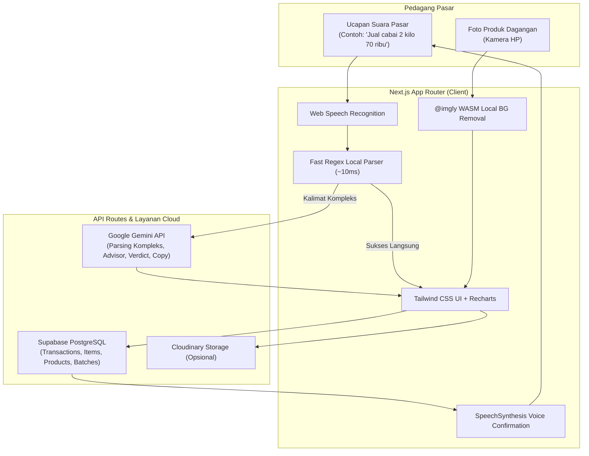

# 🌾 VokaSync — Voice-First Financial AI Advisor & Virtual Marketing Studio untuk UMKM Pasar Tradisional

[](https://nextjs.org/)
[](https://react.dev/)
[](https://www.typescriptlang.org/)
[](https://tailwindcss.com/)
[](https://supabase.com/)
[](https://ai.google.dev/)
[](https://developer.mozilla.org/en-US/docs/Web/API/Web_Speech_API)

> **Inovasi Digital Inklusif (Mendukung SDGs 9: Industri, Inovasi, dan Infrastruktur & SDGs 8: Pekerjaan Layak dan Pertumbuhan Ekonomi)**  
> *Bukan sekadar aplikasi kasir (POS), melainkan Asisten Keuangan & Strategi Bisnis Cerdas Berbasis Suara serta Studio Promosi Visual untuk Pedagang Pasar Tradisional dan Komoditas Mikro.*

---

## 📌 Daftar Isi
1. [Latar Belakang & Masalah Riil](#-1-latar-belakang--masalah-riil)
2. [Perbandingan: VokaSync vs Aplikasi Kasir Konvensional (POS)](#-2-perbandingan-vokasync-vs-aplikasi-kasir-konvensional-pos)
3. [Target Pengguna](#-3-target-pengguna)
4. [Eksplorasi Fitur Lengkap Website](#-4-eksplorasi-fitur-lengkap-website)
   - [4.1. Catat Transaksi Suara & Manual (`/catat`)](#41-catat-transaksi-suara--manual-catat)
   - [4.2. Beranda & Tren Finansial Kapsul (`/dashboard`)](#42-beranda--tren-finansial-kapsul-dashboard)
   - [4.3. Analisis Produk Dagangan & Margin (`/produk`)](#43-analisis-produk-dagangan--margin-produk)
   - [4.4. Laboratorium Taktik & Eksperimen Harga (`/eksperimen`)](#44-laboratorium-taktik--eksperimen-harga-eksperimen)
   - [4.5. Riwayat Transaksi & Struk Digital WhatsApp/Thermal (`/riwayat`)](#45-riwayat-transaksi--struk-digital-whatsappthermal-riwayat)
   - [4.6. Laporan Keuangan Toko Lengkap (`/laporan`)](#46-laporan-keuangan-toko-lengkap-laporan)
   - [4.7. Virtual Marketing Studio & AI Copywriter](#47-virtual-marketing-studio--ai-copywriter)
   - [4.8. Pengaturan Toko & Mode Demo Cepat (`/settings`)](#48-pengaturan-toko--mode-demo-cepat-settings)
5. [Arsitektur Sistem & Alur Alih Data](#-5-arsitektur-sistem--alur-alih-data)
6. [Tumpukan Teknologi (Tech Stack)](#-6-tumpukan-teknologi-tech-stack)
7. [Panduan Instalasi & Menjalankan Lokal](#-7-panduan-instalasi--menjalankan-lokal)
8. [Tim Pengembang (TIM EXASTI 2)](#-8-tim-pengembang-tim-exasti-2)
9. [Lisensi](#-9-lisensi)

---

## 🎯 1. Latar Belakang & Masalah Riil

Di pasar tradisional dan usaha mikro, mayoritas pedagang menjual komoditas basah atau curah (sayuran, cabai, bumbu giling, ikan/daging segar, buah, dan sembako) yang **tidak memiliki barcode**. Saat jam sibuk pasar subuh:
1. **Tangan Pedagang Basah, Kotor, atau Menimbang:** Mustahil dan tidak higienis mengetik di layar HP atau mencari menu kasir konvensional satu per satu.
2. **Satuan Eceran Lokal yang Dinamis:** Penjualan di pasar sering menggunakan takaran eceran seperti *ons*, *seperempat kilo*, *setengah kilo*, *ikat*, *butir*, atau *karung*.
3. **Fluktuasi Harga Kulakan Harian:** Harga beli dari agen pasar induk berubah setiap hari. Kerap kali pedagang tidak sadar bahwa harga modal sudah naik sementara harga jualnya tetap, sehingga keuntungan tergerus atau bahkan merugi tanpa disadari (*hidden losses*).
4. **Ketiadaan Pembukuan & Bukti Transaksi:** Lebih dari 80% pedagang pasar tidak memiliki catatan keuangan harian dan kesulitan mempromosikan produknya ke pelanggan luar pasar.

**VokaSync hadir memberikan solusi tuntas:** Cukup berbicara santai dengan dialek pasar sehari-hari, transaksi langsung tercatat, margin laba dihitung detik itu juga, dan poster promosi jualan WhatsApp siap dibuat dalam 10 detik.

---

## ⚖️ 2. Perbandingan: VokaSync vs Aplikasi Kasir Konvensional (POS)

| Dimensi | Aplikasi Kasir Biasa (POS) | VokaSync (Voice-First AI Advisor & Studio) |
| :--- | :--- | :--- |
| **Metode Input Utama** | Wajib mengetik nama barang, memilih dari ratusan daftar menu, atau scan barcode. | **Cukup Bicara (Voice-First)**: *"Jual bawang merah 5 kilo dapat 200 ribu"* atau *"Beli kangkung 10 ikat 50 ribu"*. Tangan basah/kotor bukan hambatan. |
| **Karakter Komoditas** | Kaku, dirancang untuk barang berkemasan pabrik dengan kode barcode tetap. | **Disesuaikan untuk komoditas pasar curah**: Otomatis mengonversi satuan eceran (kg, ons, ikat, butir, pack, dus). |
| **Peran Sistem** | **Pasif**: Sekadar mencatat angka dan menjumlahkan total penerimaan kas. | **Proaktif & Advisory**: AI menganalisis jika margin produk menipis atau rugi, lalu memberi rekomendasi harga atau taktik penjualan. |
| **Umpan Balik Suara (TTS)** | Tidak ada umpan balik suara; pengguna wajib melihat layar HP. | **Asisten Suara Ramah (Audio TTS)** yang membacakan konfirmasi lisan: *"Baik, catatan jual bawang merah 5 kilo Rp200.000 sudah tersimpan"*. |
| **Evaluasi Margin & Risiko** | Laporan statis di akhir bulan yang rumit dipahami pedagang awam. | **Deteksi Margin Detik Itu Juga**: Mengetahui apakah harga jual eceran menutup modal kulakan belanja subuh tadi secara *real-time*. |
| **Fitur Eksperimen Bisnis** | Tidak tersedia. | **Laboratorium Taktik (`/eksperimen`)**: Menguji strategi harga pada produk nyata dan mengevaluasi dampaknya secara terukur. |
| **Dukungan Pemasaran** | Tidak ada fitur pembuatan materi promosi. | **Virtual Marketing Studio**: Hapus background foto otomatis secara lokal (WASM) & buat teks promo WhatsApp siap kirim. |

---

## 👥 3. Target Pengguna

1. **Pedagang Pasar Tradisional:** Kios sayur mayur, lapak daging & ayam potong, kios cabai & bawang, bumbu dapur, buah musiman, serta toko kelontong & sembako.
2. **Usaha Kuliner Mikro & Warung Makan:** Warteg, kedai kopi sederhana, pedagang kaki lima (PKL), dan katering rumahan yang rutin belanja bahan baku di pasar induk.
3. **Pemasok Komoditas Lokal:** Peternak telur rumahan, penggilingan bumbu pasar, dan agen distributor bahan pokok.

---

## 🚀 4. Eksplorasi Fitur Lengkap Website

### 4.1. Catat Transaksi Suara & Manual (`/catat`)
- **Perekaman Suara 1-Klik:** Menggunakan Web Speech API `SpeechRecognition` dengan dukungan bahasa Indonesia (`id-ID`).
- **Dual-Engine Parser (Hybrid Regex + Google Gemini AI):** Kalimat transaksi diekstrak dalam hitungan milidetik. Jika kalimat memiliki struktur panjang atau kasual, sistem otomatis menggunakan Gemini AI untuk ekstraksi presisi.
- **Normalisasi Satuan & Pecahan:**
  - Mengenali ucapan pecahan pasar: *seperempat (0.25)*, *setengah (0.5)*, *1 ons (0.1 kg)*, *2 ons*, *goceng*, *ceban*, *gocap*, *ratusan ribu*, hingga *jutaan rupiah*.
  - Mengharmonisasi takaran belanja (kg) dengan penjualan eceran (ons) secara matematis akurat.
- **Pembeda Otomatis Arah Kas:** Mendeteksi kata kunci penjualan (*jual, laku, dapat, terima*) sebagai **Pemasukan (+)**, dan kata kunci belanja (*beli, kulak, belanja, modal, bayar*) sebagai **Pengeluaran (-)**.
- **Konfirmasi Lisan Ramah (Audio Text-to-Speech):** Asisten membacakan hasil pencatatan secara suara, sehingga pedagang tidak perlu menatap layar HP saat melayani pembeli.
- **Form Edit di Tempat (*In-Place Modal*):** Pedagang dapat meninjau dan mengedit teks nama barang, jumlah, satuan, dan total uang sebelum data disimpan ke database.
- **Pencatatan Manual Cepat:** Tersedia form manual lengkap dengan fitur pencarian produk kios, pembuat produk baru instan, stepper jumlah, dan opsi satuan lengkap.

### 4.2. Beranda & Tren Finansial Kapsul (`/dashboard`)
- **Kartu Metrik Finansial:** Menampilkan Omzet Penjualan, Belanja Modal, Laba Bersih Usaha, dan Rata-rata Margin Riil.
- **Grafik Tren Kapsul Modern (Capsule Bar Chart):** Visualisasi data arus kas 7 hari terakhir yang kontras tinggi antara Uang Masuk (Hijau Zamrud `#00875A`) dan Uang Keluar (Sunset Amber `#EA580C`).
- **Asisten AI Suara Harian:** Menyapa pedagang sesuai waktu (Pagi/Siang/Sore/Malam), menganalisis kondisi keuangan terkini, dan dapat didengarkan langsung lewat tombol pemutar suara.
- **Sorotan Komoditas Cepat:** Menampilkan komoditas paling menguntungkan (*most profitable*), komoditas dengan margin tipis (*least profitable*), dan peringatan stok menipis.

### 4.3. Analisis Produk Dagangan & Margin (`/produk`)
- **Kartu Produk Interaktif:** Menampilkan foto produk, nama komoditas, estimasi volume harian, harga beli (modal), harga jual (eceran), dan sisa stok.
- **Label Kategori Tindakan Margin Otomatis:**
  - 🟢 **Perbanyak Jual** (*Dorong*): Margin tinggi (>35%), sangat menguntungkan untuk diperbanyak promosinya.
  - 🔵 **Sudah Bagus** (*Pertahankan*): Margin sehat dan stabil di atas ambang batas target.
  - 🟡 **Perlu Diperbaiki** (*Perbaiki*): Margin tergerus di bawah target toko, perlu evaluasi harga.
  - 🔴 **Kurangi Stok** (*Kurangi*): Margin sangat tipis atau merugi, pertimbangkan kurangi pembelian modal.
  - ⚪ **Stok Baru**: Barang yang baru dibeli dan belum ada riwayat penjualan (mencegah salah klasifikasi sebelum harga jual ditentukan).
- **Penanganan Status Harga Bersih:** Jika produk belum memiliki harga jual atau harga modal, sistem menampilkan keterangan *"Belum ada"* atau *"Belum diatur"* secara rapi tanpa memunculkan angka Rp0 atau teks yang membingungkan.
- **Kalkulator Eceran Lapangan (Per Ons):** Konversi otomatis harga 1 ons (100g), 2 ons (200g), dan 1/4 kg (250g) dari harga per kilogram beserta estimasi untungnya.
- **Catatan Analisis Penasihat AI:** Memberikan saran taktik harga dan strategi khusus untuk produk yang dipilih.
- **Tambah & Edit Produk:** Mendukung unggah foto produk langsung dari kamera HP atau galeri file.

### 4.4. Laboratorium Taktik & Eksperimen Harga (`/eksperimen`)
- **Uji Coba Strategi Bisnis Riil:** Pedagang dapat membuat eksperimen perubahan harga (misal: menaikkan harga jual komoditas sebesar Rp2.000/kg atau membuat paket bundling).
- **Pemantauan Metrik Baseline vs Berjalan:** Menghitung margin awal sebelum pengujian dan membandingkannya dengan transaksi penjualan riil selama masa eksperimen.
- **Evaluasi Keputusan oleh AI Gemini:** Asisten AI mengevaluasi hasil eksperimen setelah periode berjalan dan memberikan kesimpulan apakah taktik tersebut layak dipertahankan atau dihentikan.

### 4.5. Riwayat Transaksi & Struk Digital WhatsApp/Thermal (`/riwayat`)
- **Daftar Catatan Terperinci:** Menampilkan seluruh transaksi masuk dan keluar, lengkap dengan tanggal, jam, sumber (suara/manual), dan rincian kuantitas komoditas.
- **Cetak Struk Kertas Kasir (Format Thermal Paper):** Tampilan struk kasir profesional siap cetak ke printer kasir Bluetooth thermal.
- **Kirim Struk WhatsApp 1-Klik:** Menghasilkan format teks struk belanja resmi beridentitas toko yang langsung terbuka di aplikasi WhatsApp pelanggan.

### 4.6. Laporan Keuangan Toko Lengkap (`/laporan`)
- **Laporan Laba Rugi Komprehensif:** Rekapitulasi omzet kotor, total modal belanja harian/bulanan, dan laba operasional bersih.
- **Analisis Kinerja Komoditas:** Peringkat produk dengan kontribusi pendapatan tertinggi dan efisiensi margin terbaik.
- **Filter Rentang Waktu Fleksibel:** Opsi filter 7 Hari Terakhir, 30 Hari, Bulan Ini, atau Rentang Tanggal Kustom.
- **Fitur Ekspor & Cetak:** Kemudahan mengunduh atau mencetak laporan keuangan untuk keperluan pembukuan toko atau pengajuan modal usaha.

### 4.7. Virtual Marketing Studio & AI Copywriter
- **AI Background Removal Tanpa Server Tambahan:** Menghapus latar belakang foto produk secara privat dan instan langsung di peramban menggunakan WebAssembly lokal (`@imgly/background-removal`).
- **Template Poster Promosi Siap Pakai:** Tersedia beragam bingkai menarik (Pasar Segar, Minimalis Bersih, Panen Raya, Pastel Canva, Neon, dan Kriya).
- **AI Copywriting Generator (Google Gemini):** Membuat teks promosi WhatsApp dengan 3 pilihan gaya bahasa:
  - *Gaya Pasar*: Ramah, merakyat, dan akrab khas pedagang pasar.
  - *Gaya FOMO*: Menekankan stok terbatas dan promo waktu terbatas.
  - *Gaya Elegan*: Rapi, bersih, dan profesional.
- **Simpan & Bagikan:** Unduh hasil poster promosi beresolusi tinggi (PNG) atau bagikan langsung ke grup WhatsApp pelanggan.

### 4.8. Pengaturan Toko & Mode Demo Cepat (`/settings`)
- **Profil Toko:** Mengatur nama kios/toko, nama pemilik, dan kategori usaha komoditas.
- **Ambang Batas Target Margin:** Kustomisasi batas minimum persentase laba aman (default: 20%).
- **Mode Demo Instan (Pak Budi):** Opsi 1-klik untuk mengaktifkan simulasi toko demo terisi data lengkap tanpa perlu pendaftaran akun terlebih dahulu.
- **Pusat Bantuan & Panduan Suara (`/settings/bantuan`):** Cheatsheet contoh ucapan suara dan tata cara pemakaian seluruh fitur aplikasi.

---

## 🏗️ 5. Arsitektur Sistem & Alur Alih Data



---

## 🛠️ 6. Tumpukan Teknologi (Tech Stack)

- **Kerangka Kerja (Framework):** [Next.js](https://nextjs.org/) (App Router, React Server Components & Client Hooks)
- **Bahasa Pemrograman:** [TypeScript](https://www.typescriptlang.org/) & JavaScript (ES6+)
- **Desain & Tata Letak:** [Tailwind CSS](https://tailwindcss.com/) (Mobile-First, Responsive Layout)
- **Basis Data & Autentikasi:** [Supabase](https://supabase.com/) PostgreSQL dengan Row-Level Security (RLS)
- **Kecerdasan Buatan (AI Engine):** [Google Gemini API](https://ai.google.dev/) (`gemini-2.5-flash`)
- **Mesin Suara:** Web Speech API (`SpeechRecognition` & `SpeechSynthesis`)
- **Segmentasi Foto Visual:** `@imgly/background-removal` (In-Browser WebAssembly Engine)
- **Visualisasi Data:** [Recharts](https://recharts.org/) dengan Custom SVG Capsule Pill Pattern
- **Ikon Antarmuka:** [Lucide React](https://lucide.dev/)

---

## 💻 7. Panduan Instalasi & Menjalankan Lokal

### 7.1. Prasyarat Sistem
- **Node.js**: Versi 18.x atau 20.x ke atas
- **NPM** atau **Yarn**
- Akun dan Database [Supabase](https://supabase.com/)
- API Key [Google Gemini](https://aistudio.google.com/)

### 7.2. Kloning Repositori
```bash
git clone https://github.com/roymartin-glitch/VocaSync-EXASTI-2026.git
cd VocaSync-EXASTI-2026
```

### 7.3. Pemasangan Dependensi
```bash
npm install
```

### 7.4. Konfigurasi Berkas Lingkungan (`.env.local`)
Buat berkas `.env.local` di direktori utama:
```env
# Supabase Configuration
NEXT_PUBLIC_SUPABASE_URL=https://your-project.supabase.co
NEXT_PUBLIC_SUPABASE_ANON_KEY=eyJhbGciOi...
SUPABASE_SERVICE_ROLE_KEY=eyJhbGciOi...

# Google Gemini AI Key
GEMINI_API_KEY=AIzaSy...

# Cloudinary (Opsional untuk simpan gambar cloud)
CLOUDINARY_CLOUD_NAME=your_cloud_name
CLOUDINARY_API_KEY=your_api_key
CLOUDINARY_API_SECRET=your_api_secret
```

### 7.5. Inisialisasi Skema Basis Data
Jalankan skrip SQL yang berada pada direktori:
- `supabase/schema/full_schema.sql` (atau jalankan urut dari `01_profiles.sql` hingga `07_stock_batches.sql`) pada SQL Editor di dashboard Supabase Anda.

### 7.6. Menjalankan Server Pengembangan
```bash
npm run dev
```
Akses aplikasi melalui peramban di: `http://localhost:3000`.

### 7.7. Validasi Build Produksi
```bash
npm run build
```
*Divalidasi lolos 100% tanpa error kompilasi TypeScript.*

---

## 👥 8. Tim Pengembang (TIM EXASTI 2)

Karya inovasi ini dirancang dan dikembangkan untuk **Kompetisi EXASTI 2.0 (2026)** oleh **Tim EXASTI 2** — **Universitas Tanri Abeng**:

1. 🌟 **Silvi Audina**
2. 🌟 **Roy Martin Gulo**
3. 🌟 **Rico Arya Rivanhani**
4. 🌟 **Muhammad Adi Pramana**

---

## 📄 9. Lisensi

Hak Cipta © 2026 **TIM EXASTI 2 (VokaSync)**.  
Dikembangkan untuk mempercepat transformasi digital yang inklusif bagi pedagang pasar tradisional dan pelaku UMKM Indonesia.
